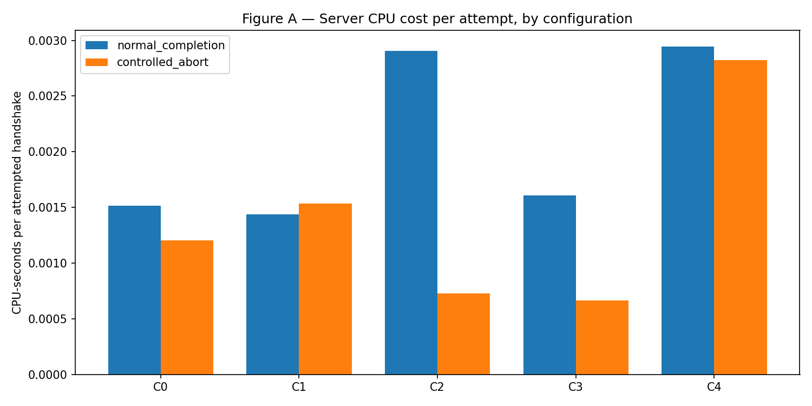
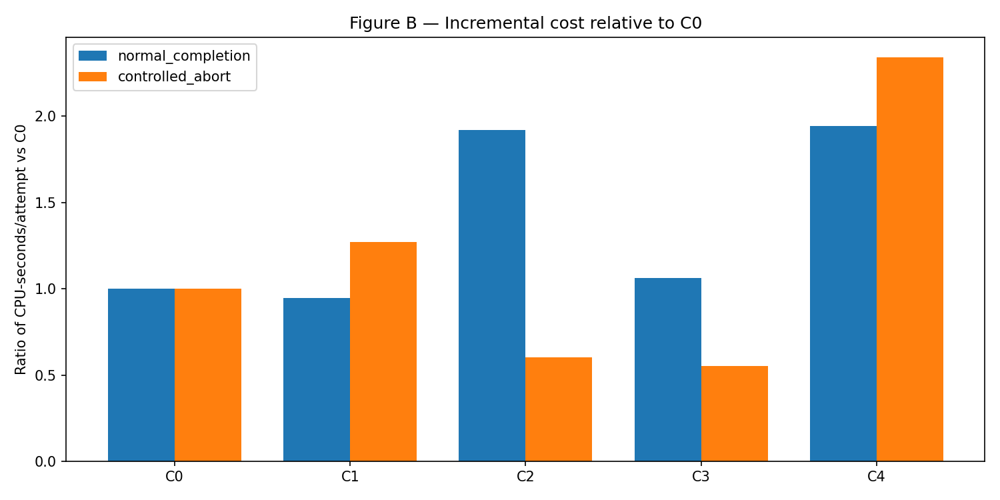
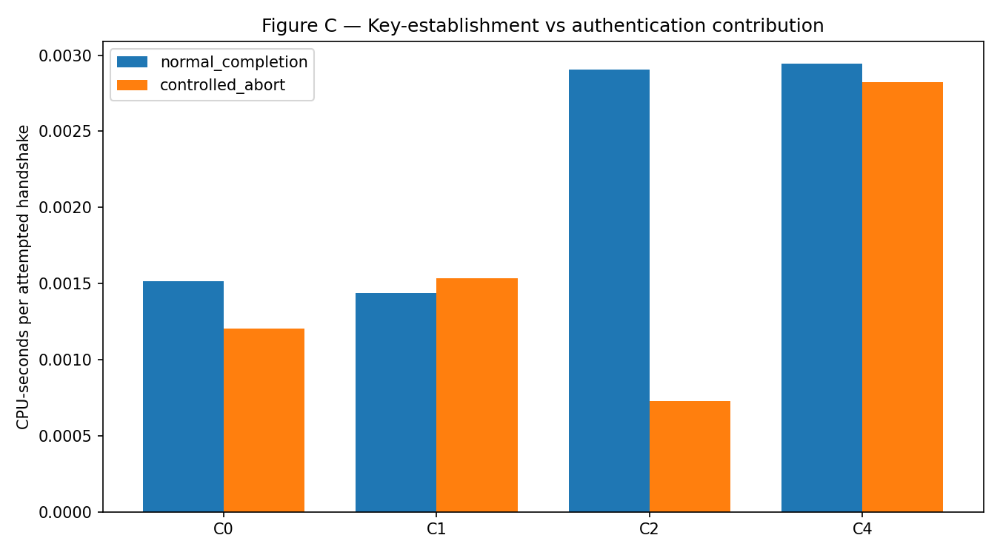
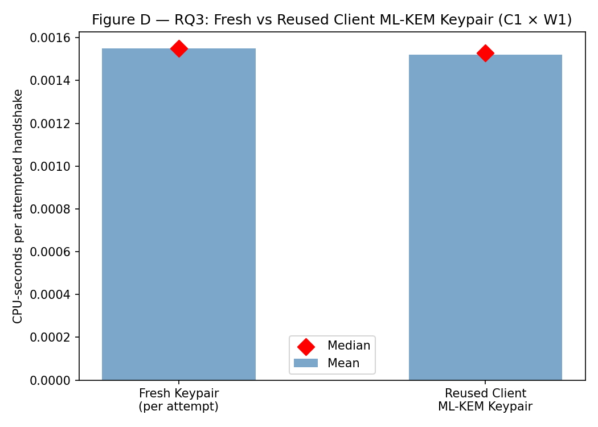
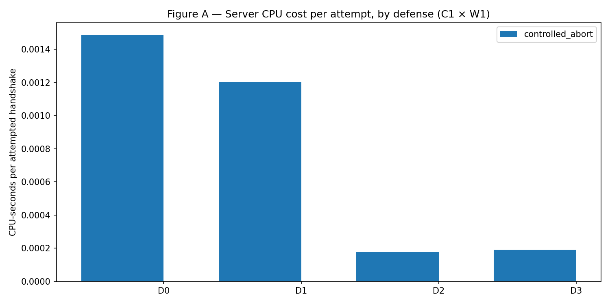
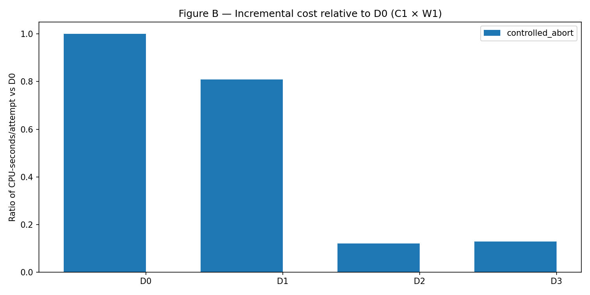
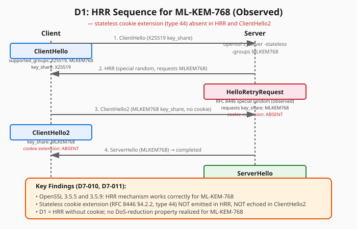

# PQ-TLS Handshake Exhaustion: Cost Decomposition and Mitigation

## Executive Summary

This project measures the server-side CPU cost of TLS 1.3 handshakes across classical and post-quantum cipher suites under controlled handshake-exhaustion workloads, and evaluates whether standardized admission controls reduce that cost without unacceptable legitimate-client impact.

Prior work (Lee et al., arXiv:2607.12504, 2026) established that switching a TLS 1.3 server from classical (ECDSA-P256 + X25519) to post-quantum (ML-KEM-768 + ML-DSA-65) greatly prolongs high-CPU duration under handshake-flood workloads. This project decomposes that aggregate overhead into per-component contributions (key establishment vs. authentication, classical vs. PQ, hybrid vs. standalone) and evaluates three admission-control mechanisms already defined in TLS 1.3.

**Strongest findings:**

- ML-DSA-65 authentication contributes ~2× server CPU cost over ECDSA-P256 in completed-handshake (W0) conditions (C2 vs C0)
- ML-KEM-768 key establishment adds modest cost in W0 but is comparable to X25519 in controlled-abort W1 (C1 vs C0)
- Controlled pre-Finished abort (W1) isolates pre-completion cost; C2 and C3 show lower W1 cost than C0 (server aborts before signature verification)
- The tested OpenSSL 3.5.x `s_server -stateless` path produces HRR for ML-KEM-768 **without the stateless cookie extension** (`cookie_observed = false`) — a measured limitation, not a successful cookie defense
- Source admission budget (D2: 5 connections/sec/source) reduces server CPU/attempt by ~88% with 100% legitimate-client success
- Combined D3 (D1+D2) achieves similar reduction; D1 alone (HRR without cookie) shows no CPU reduction

---

## Research Questions

| ID | Question | Status |
|----|----------|--------|
| **RQ1** | How does normalized server CPU cost per attempted handshake change when ML-KEM and ML-DSA are introduced independently and jointly? | **Answered** (Phase 5) |
| **RQ2** | Which handshake stage accounts for the largest incremental PQ-related server cost? | **Answered** (Phase 5: authentication dominates in W0; key-establishment dominates in W1 for C4) |
| **RQ3** | Does reusing the client's ML-KEM keypair across attempts materially change attacker-side preparation cost or server-side processing cost per attempt? | **Unresolved** — Phase 6 client falls back to fresh keypair per attempt; true reuse not implemented |
| **RQ4** | Does a stateless TLS 1.3 HelloRetryRequest cookie reduce expensive handshake processing under controlled PQ-TLS exhaustion workloads? | **Measured Limitation** — HRR observed but cookie extension NOT observed for ML-KEM-768 in OpenSSL 3.5.x |
| **RQ5** | What is the cost, in legitimate-client success rate, latency, and added round trips, of each defense evaluated? | **Answered** (Phase 7) |

> **Critical Note on RQ3:** The implemented Phase 6 client (`src/workload/client.py`) falls back to fresh keypair per attempt in both `fresh_keypair` and `reused_client_keypair` conditions. True ML-KEM keypair reuse requires a custom OpenSSL C API client. The null result (mean ratio 0.981, Δ = −0.000030 s/att) reflects fresh keypairs in both conditions.

> **Critical Note on RQ4/RQ5:** The D1 mechanism in this testbed is **HRR without cookie** for ML-KEM-768. The RFC 8446 stateless cookie extension (type 44) was not emitted in HRR or echoed in ClientHello2. This is a measured outcome of the tested OpenSSL 3.5.x path, not missing data.

---

## Key Findings

### Component Cost Decomposition (Phase 5, C0–C4 × W0/W1 × 3 trials)

| Config | Key Establishment | Authentication | W0 CPU/attempt (ms) | W1 CPU/attempt (ms) |
|--------|-------------------|----------------|---------------------|---------------------|
| **C0** | X25519 | ECDSA-P256 | **1.51** | **1.21** |
| **C1** | ML-KEM-768 | ECDSA-P256 | 1.44 | **1.53** |
| **C2** | X25519 | ML-DSA-65 | **2.91** | 0.73 |
| **C3** | X25519+ML-KEM-768 | ECDSA-P256 | 1.61 | 0.67 |
| **C4** | ML-KEM-768 | ML-DSA-65 | **2.94** | **2.82** |

**Interpretation:**
- **W0 (completed):** ML-DSA-65 authentication (C2, C4) dominates cost (~2× C0). ML-KEM-768 alone (C1) is comparable to classical.
- **W1 (controlled abort):** C2 and C3 show *lower* pre-completion cost than C0 (server aborts before signature verification). C4 remains high (ML-KEM encapsulation + ML-DSA verification both occur pre-Finished).

### Key-Reuse Experiment (Phase 6, C1 × W1)

| Condition | CPU/attempt (ms) | Δ vs Fresh |
|-----------|------------------|------------|
| Fresh keypair (mean) | 1.550 | — |
| Reused keypair (mean) | 1.520 | −0.030 (−1.9%) |
| Paired ratio (reused/fresh) | — | 0.981 |

**Conclusion:** No material server-side cost difference. The server performs ML-KEM encapsulation (fresh randomness per attempt) regardless of client keypair reuse. Attacker-side key-generation savings not measured in this testbed. **True keypair reuse was not implemented; RQ3 remains unresolved.**

### Defense Evaluation (Phase 7, C1 × W1 × D0–D3 × 3 trials = 12 campaign trials)

| Defense | Mechanism | CPU/attempt (ms) | Reduction vs D0 | Legitimate Success | Legitimate p50 Latency |
|---------|-----------|------------------|-----------------|-------------------|------------------------|
| **D0** | Baseline | 1.49 | — | 96% (25/26) | 186 ms |
| **D1** | HRR (no cookie) | 1.54 | **+3%** | 100% (26/26) | 189 ms |
| **D2** | Source budget (5/sec) | **0.18** | **−88%** | 100% (25/25) | 194 ms |
| **D3** | D1 + D2 | **0.19** | **−87%** | 100% (24/24) | 193 ms |

**D1 Detail (observed sequence):** `ClientHello` → `HelloRetryRequest` (special random, requests MLKEM768) → `ClientHello2` (MLKEM768 key_share) → `ServerHello` (MLKEM768) → **completed**. `cookie_observed = false`.

**D2/D3 Detail:** Token bucket (5 tokens, 5/sec refill) at proxy. ~87% of workload attempts rejected at proxy; only ~13% reach TLS server. Legitimate client at 1/sec passes unimpeded.

---

## Experimental Configurations

| ID | Key Establishment | Authentication | Purpose |
|----|-------------------|----------------|---------|
| **C0** | X25519 | ECDSA-P256 | Classical baseline |
| **C1** | ML-KEM-768 | ECDSA-P256 | Isolates PQ key-establishment cost |
| **C2** | X25519 | ML-DSA-65 | Isolates PQ authentication cost |
| **C3** | X25519+ML-KEM-768 | ECDSA-P256 | Hybrid key establishment (RFC 10024) |
| **C4** | ML-KEM-768 | ML-DSA-65 | Combined PQ configuration |

All 5 configurations negotiated successfully on OpenSSL 3.5.5 (default provider). No `oqs-provider` required.

---

## Workload Model

| Mode | Description | Denominator |
|------|-------------|-------------|
| **W0** | Full TLS 1.3 handshake to completion | All bounded attempts |
| **W1** | Client sends ClientHello, disconnects pre-Finished | All bounded attempts |

Hard limits (enforced in code, not config): `max_attempts: 1000`, `max_duration_seconds: 30`, `max_concurrency: 1`.

> **Note:** W2 (repeated bounded attempts) is an internal orchestration concept, not a separate workload mode exposed in results.

---

## Defense Model

| ID | Mechanism | Implementation |
|----|-----------|----------------|
| **D0** | Baseline | No admission control |
| **D1** | Stateless HRR cookie | `openssl s_server -stateless` with MLKEM768 preferred group; client offers X25519:MLKEM768 with X25519 key_share → triggers HRR |
| **D2** | Source admission budget | Userspace asyncio proxy (5 tokens, 5/sec refill) on 4433 → TLS server on 4434 |
| **D3** | Combined | D2 proxy → D1 stateless server |

---

## Architecture

```
                          ┌──────────────────────────┐
                          │   Experiment Controller   │
                          │ matrix · safety limits ·  │
                          │ repetitions · logging     │
                          └─────────────┬─────────────┘
                                        │
                  ┌──────────────────── ┴ ──────────────────┐
                  │                                         │
                  ▼                                         ▼
       ┌────────────────────────┐              ┌────────────────────────┐
       │ Controlled TLS Workload│              │ Legitimate TLS Client  │
       │ bounded attempts only  │              │ steady background rate │
       └────────────┬────────────┘              └────────────┬────────────┘
                    │                                         │
                    └──────────────────┬──────────────────────┘
                                       ▼
                           ┌─────────────────────┐
                           │  Laboratory Network  │
                           │  Docker bridge       │
                           └──────────┬───────────┘
                                      ▼
                           ┌─────────────────────┐
                           │   TLS 1.3 Server     │
                           │ OpenSSL 3.5+, C0–C4  │
                           │ defense layer (D0–D3)│
                           └──────────┬───────────┘
                                      ▼
                           ┌─────────────────────┐
                           │   Instrumentation    │
                           │ pidstat · tcpdump ·  │
                           │ TLS transcripts      │
                           └─────────────────────┘
```

**Defense Layer (D1–D3):**
```
ClientHello
    │
    ▼
┌───────────────────────┐
│ Admission decision     │
│ HRR required? (D1)     │
│ cookie observed? (D1)  │
│ source budget? (D2)    │
└───────────┬─────────────┘
            │ accepted
            ▼
      TLS 1.3 processing
```

---

## Measurement Methodology

| Stream | Tool | Scope | Normalization |
|--------|------|-------|---------------|
| **CPU** | `pidstat` (1 Hz) inside TLS-server container, targeting `openssl s_server` PID | Workload execution window | CPU-seconds / **all** bounded attempts (completed + aborted + failed) |
| **Bytes** | `tcpdump` on lab interface/port, IP-packet length (excludes Ethernet) | Experiment window | Bytes / **all** bounded attempts |
| **TLS Events** | OpenSSL `s_client -msg -state` transcript parsing | Per attempt | `negotiated_group`, `negotiated_signature_algorithm` **nullable**; provenance-tracked |

**Provenance Rules (locked):**
- Negotiated fields **must be null** when observation doesn't expose them — never fabricated from config
- `measurement_status` per stream: `measured` | `unavailable` | `failed` — missing values are `null`, never `0`
- Three evidence streams (TLS, CPU, packets) remain independent — no stream proxies another

**Safety:** All experiments target `localhost`/`127.0.0.1`/`tls-server` (Docker service). Mandatory preflight test rejects `8.8.8.8`, accepts lab targets. Hard limits enforced in `src/controller/safety.py`.

---

## Results (Key Figures)

### Figure A: CPU-seconds per attempt by configuration and workload


### Figure B: Incremental cost relative to C0 (delta and ratio)


### Figure C: Key-establishment vs authentication (C1 vs C2 vs C4)


### Figure D: Fresh vs reused ML-KEM keypair (RQ3)

*Null result — true keypair reuse not implemented in Phase 6 client*

### Figure E: Defense effectiveness (D0–D3 CPU reduction)


### Figure F: Legitimate-client trade-off per defense


---

## D1 Finding: HRR Without Cookie for ML-KEM-768

The D1 defense was intended to evaluate the TLS 1.3 stateless HelloRetryRequest cookie (RFC 8446 §4.2.2). In the tested OpenSSL 3.5.x (3.5.5 and 3.5.9) with ML-KEM-768:

**Observed sequence (validated via packet capture + OpenSSL transcript):**
```
ClientHello (supported_groups=X25519:MLKEM768, key_share=X25519)
    ↓
HelloRetryRequest (RFC 8446 special random, requests MLKEM768 key_share)
    ↓
ClientHello2 (key_share=MLKEM768)
    ↓
ServerHello (group=MLKEM768) → completed
```

**Critical observation:** The stateless **cookie extension (type 44) was NOT present** in the HRR and NOT echoed in ClientHello2. `cookie_observed = false` is a measured outcome.

**Implication:** The HRR mechanism operates but without the stateless cookie's DoS-reduction property (server still processes ClientHello2 → encapsulation). D1 in this testbed reduces to HRR-induced 1-RTT delay, not cookie-based filtering.

The custom `SSL_stateless()` C server was abandoned (D7-010) due to `SSL_R_INTERNAL_ERROR` in `tls_construct_stoc_cookie` for ML-KEM-768 in both OpenSSL 3.5.5 and 3.5.9.



---

## Admission Control Result (D2/D3)

- **~88% CPU reduction** vs D0 (0.18–0.19 ms/attempt vs 1.49 ms/attempt)
- **100% legitimate-client success** at 1 request/sec (target rate)
- **~87% workload rejection** at proxy layer (872–874 of 1000 attempts rejected)
- Legitimate client p50 latency unchanged (~185–195 ms)
- D3 (combined) provides no additional benefit over D2 alone in this configuration

---

## Challenges and Failures (Documented from Project History)

| Phase | Problem | Investigation | Resolution | Final Status |
|-------|---------|---------------|------------|--------------|
| **1** | Initial instrumentation used host `psutil` + Docker cumulative stats | CPU methodology locked (PRD §8.1) | Switched to in-container `pidstat` at 1 Hz; Docker stats rejected as primary | **Resolved** |
| **2** | TLS provenance: negotiated values fabricated from config | F-01 forensic review | `normalize_tls_event()` now takes only `NegotiationObservation`; config never consulted | **Resolved** |
| **3** | W1 "controlled abort" was completing handshakes | F-02: state machine analysis | `do_handshake_on_connect=False` + non-blocking socket; completes → `error`, never `aborted` | **Resolved** |
| **4** | `tcpdump` capture blocked indefinitely; no explicit stop | F-03: lifecycle redesign | `start_packet_capture()`/`stop_packet_capture()` with SIGINT; timeout = backstop only | **Resolved** |
| **4** | CPU PID ambiguity: shell wrapper matched `openssl s_server` | F-05: `/proc/*/cmdline` inspection | Require exact `openssl` executable + `s_server` in args; reject shell wrappers | **Resolved** |
| **5** | IPv6 `::1` resolution in Docker | Network debugging | Use `127.0.0.1` for host→container; service names for container→container | **Resolved** |
| **6** | Client ML-KEM keypair reuse not implemented in `openssl s_client` | OpenSSL CLI limitation | Documented fallback to fresh keypair; true reuse requires custom C client | **Limitation** |
| **7** | Custom `SSL_stateless()` C server failed (`SSL_R_INTERNAL_ERROR`) | OpenSSL 3.5.5 + 3.5.9 debugging | Abandoned custom server; adopted `openssl s_server -stateless` CLI (D7-010) | **Resolved** |
| **7** | D1 pilot failed: W1 capture window couldn't observe full HRR flow | W1 aborts pre-Finished → no ClientHello2/ServerHello | Added separate Phase B validation (full handshakes, dedicated pcap) (D7-005) | **Resolved** |
| **7** | Legitimate client used host Python (OpenSSL 3.0) → couldn't negotiate ML-KEM | TLS version mismatch | Switched to in-network `openssl s_client` in workload container (D7-006) | **Resolved** |
| **7** | RTT extraction from pcap | Packet parsing complexity | Implemented TLS handshake message parsing from pcap (1 RTT vs 2 RTT) | **Partial** |
| **All** | OpenSSL PQ interoperability (C2/C3/C4 negotiation) | Phase 0 verification | All 5 configurations SUPPORTED on OpenSSL 3.5.5 default provider | **Resolved** |

---

## Limitations

1. **Single-source IP:** All traffic from one client IP; no distributed attack simulation
2. **Localhost/Docker environment:** No real network path, no NAT, no middleboxes
3. **Bounded attempts/time:** 1000 attempts / 30 sec / concurrency 1 — not sustained flood
4. **No application payload:** Handshake-only; no record-layer processing measured
5. **No real Internet traffic:** Synthetic workload only
6. **RTT unavailable for main campaign:** Packet-capture RTT parsing implemented for Phase 7 validation only; main campaign reports wall-clock latency only
7. **D1 cookie absent:** OpenSSL 3.5.x does not emit stateless cookie for ML-KEM-768; D1 ≠ RFC 8446 cookie defense
8. **Phase 6 keypair reuse not actually tested:** Client falls back to fresh keypair per attempt
9. **Docker Desktop networking:** Bridge network on Windows/macOS host adds variability
10. **Single OpenSSL version:** Results specific to 3.5.x default provider; other providers/versions may differ

---

## Reproducibility

**Environment:**
- OpenSSL 3.5.5+ (default provider; native ML-KEM-768, ML-DSA-65, X25519MLKEM768 support)
- Docker 29.x + Compose v5.x
- Python 3.11+ (orchestration), Alpine 3.22 (containers)
- Linux kernel with `pidstat` (sysstat), `tcpdump`

**Running Experiments:**
```bash
# Setup
./scripts/setup.sh

# Phase 5: Component decomposition (C0–C4 × W0/W1 × 3 trials)
python scripts/run_phase5.py

# Phase 6: Key reuse (C1 × W1 × fresh/reused × 3 trials)
python scripts/run_phase6.py

# Phase 7: Defense evaluation (C1 × W1 × D0–D3 × 3 trials)
python scripts/run_phase7.py
python scripts/run_phase7_analysis.py
```

**Test Suite:**
```bash
python -m pytest tests/ -v
# 129 collected, 122 passed, 7 skipped, 0 failed, 0 errors
```

**Skipped Tests (7) — Not Coverage Gaps:**
- `test_parse_handshake_rtt_baseline`, `test_parse_handshake_rtt_hrr` — require real pcap files (integration test)
- `test_admission_accepted`, `test_admission_rejected`, `test_legitimate_client_passes` — require running proxy container
- `test_rejected_attempts_no_tls_event`, `test_admission_field_in_result` — integration-only

All skipped tests are integration tests requiring live containers; unit test coverage is complete.

---

## Project Structure (Public Repository)

```
pq-tls-handshake-research/
├── README.md
├── .gitignore
├── LICENSE
├── requirements.txt
├── pytest.ini
├── config/
│   ├── experiment_matrix.yaml
│   ├── safety_limits.yaml
│   ├── c0_experiment.yaml
│   ├── c1_experiment.yaml
│   ├── c2_experiment.yaml
│   ├── c3_experiment.yaml
│   ├── c4_experiment.yaml
│   ├── c1_w1_d0.yaml
│   ├── c1_w1_d1.yaml
│   ├── c1_w1_d2.yaml
│   ├── c1_w1_d3.yaml
│   ├── c1_w1_fresh.yaml
│   ├── c1_w1_reused.yaml
│   ├── pilot_c0_w0.yaml
│   └── pilot_c0_w1.yaml
├── lab/
│   ├── server/
│   │   ├── generate_certs.sh
│   │   ├── generate_certs_c2.sh
│   │   ├── generate_certs_c4.sh
│   │   ├── Dockerfile.d1-stateless
│   │   └── Dockerfile.proxy
│   └── network/
│       ├── docker-compose.yml
│       ├── docker-compose-c0.yml
│       ├── docker-compose-c1.yml
│       ├── docker-compose-c2.yml
│       ├── docker-compose-c3.yml
│       ├── docker-compose-c4.yml
│       ├── docker-compose-c1-d1.yml
│       ├── docker-compose-c1-d2.yml
│       └── docker-compose-c1-d3.yml
├── scripts/
│   ├── setup.sh
│   ├── lab.sh
│   ├── collect.sh
│   ├── run_pilot.py
│   ├── run_phase5.py
│   ├── run_phase6.py
│   ├── run_phase7.py
│   ├── run_phase7_analysis.py
│   ├── run_d1_pilot.py
│   ├── run_c0_trials.py
│   ├── test_cpu.py
│   └── test_packets.py
├── src/
│   ├── __init__.py
│   ├── controller/
│   │   ├── __init__.py
│   │   ├── config.py
│   │   ├── experiment.py
│   │   └── safety.py
│   ├── workload/
│   │   ├── __init__.py
│   │   └── client.py
│   ├── legitimate_client/
│   │   ├── __init__.py
│   │   └── client.py
│   ├── instrumentation/
│   │   ├── __init__.py
│   │   ├── container.py
│   │   ├── cpu.py
│   │   ├── packets.py
│   │   └── tls_log.py
│   ├── defense/
│   │   ├── __init__.py
│   │   └── admission_proxy.py
│   └── analysis/
│       ├── __init__.py
│       ├── decompose.py
│       └── loader.py
├── tests/
│   ├── __init__.py
│   ├── test_safety.py
│   ├── test_preflight.py
│   ├── test_c0.py
│   ├── test_c1.py
│   ├── test_c2.py
│   ├── test_c3.py
│   ├── test_c4.py
│   ├── test_f01_tls_provenance.py
│   ├── test_f02_controlled_abort.py
│   ├── test_f03_packet_capture.py
│   ├── test_f04_controller_integration.py
│   ├── test_f05_cpu_sampling.py
│   ├── test_d1_hrr_behavior.py
│   ├── test_d1_validation_integration.py
│   ├── test_d2_token_bucket.py
│   └── test_d3_composition.py
├── assets/
│   ├── figures/
│   │   ├── figure_a.png
│   │   ├── figure_b.png
│   │   ├── figure_c.png
│   │   ├── figure_d.png
│   │   ├── figure_d_paired.png
│   │   ├── phase7_figure_a.png
│   │   └── phase7_figure_b.png
│   └── diagrams/
│       ├── architecture.svg
│       ├── config_matrix.svg
│       ├── d1_hrr_sequence.svg
│       ├── defense_layer.svg
│       ├── measurement_triangle.svg
│       └── challenges.svg
└── web/                      # Static research showcase (optional)
    ├── public/
    │   ├── index.html
    │   ├── style.css
    │   ├── app.js
    │   ├── data/
    │   └── assets/
```

---

## Safety

All experiments are strictly bounded and localhost-only:
- **Target allowlist:** `localhost`, `127.0.0.1`, `::1`, Docker service names (resolvable only inside lab network)
- **Hard ceilings (code-enforced):** 1000 attempts, 30 seconds, concurrency 1
- **No unbounded mode, no IP spoofing, no public-target discovery, no reflection/amplification**
- **Mandatory preflight test** (`tests/test_preflight.py`) must pass before any run
- **No custom cryptography:** OpenSSL 3.5+ exclusively; `oqs-provider` permitted but not required
- **Certificate handling:** Self-signed certs generated at runtime in temp dirs; deleted after use; never committed

---

## License

MIT License — see [LICENSE](LICENSE) for details.

---

## Citation

```bibtex
@misc{pq-tls-handshake-exhaustion,
  title = {PQ-TLS Handshake Exhaustion: Cost Decomposition and Mitigation},
  author = {Gagan},
  year = {2026},
  note = {Experimental testbed and analysis code},
  url = {https://github.com/...}
}
```

---

## Static Research Showcase

A zero-dependency, client-side visualization site is available at `web/public/index.html` (serve with `python -m http.server -d web/public`). It provides interactive charts for all figures, the D1 HRR sequence diagram, defense comparisons, and the engineering challenges timeline — **no backend, no experiment execution, no Docker control**.

To view locally:
```bash
cd web/public && python -m http.server 8080
# Open http://localhost:8080
```