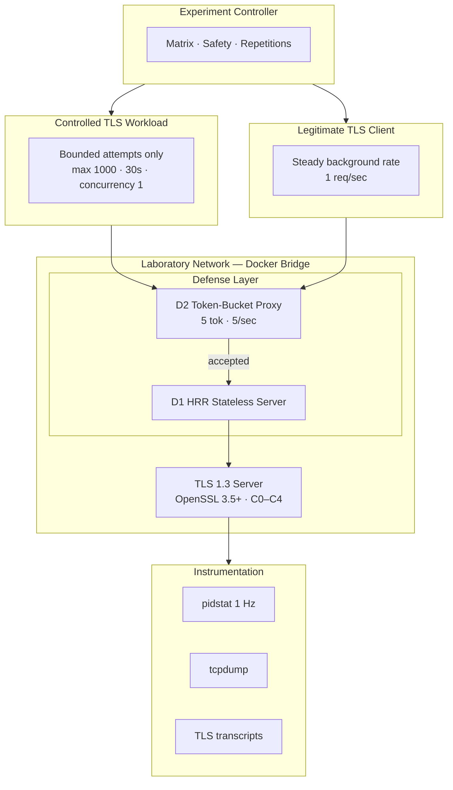

<](LICENSE)
[](https://www.python.org/)
[](https://www.openssl.org/)
[](#test-suite)
[](https://www.docker.com/)

[**Interactive Research Showcase →**](web/public/index.html)

</div>

---

## Table of Contents

- [Executive Summary](#executive-summary)
- [Key Findings](#key-findings)
- [Research Questions](#research-questions)
- [Experimental Matrix](#experimental-matrix)
- [Workload Model — W0 vs W1](#workload-model--w0-vs-w1)
- [Measurement Methodology](#measurement-methodology)
- [Phase 5 — Component Decomposition](#phase-5--component-decomposition)
- [D1 — HRR Without Observed Cookie](#d1--hrr-without-observed-cookie)
- [Phase 7 — Defense Evaluation (D0–D3)](#phase-7--defense-evaluation-d0d3)
- [RQ3 — Why It Remains Unresolved](#rq3--why-it-remains-unresolved)
- [How to Run Everything](#how-to-run-everything)
- [Test Suite](#test-suite)
- [Safety Boundary](#safety-boundary)
- [Limitations](#limitations)
- [Repository Structure](#repository-structure)
- [Citation](#citation)
- [License](#license)

---

## Executive Summary

Prior work (Lee et al., arXiv:2607.12504, 2026) established that switching a TLS 1.3 server from classical (ECDSA-P256 + X25519) to post-quantum (ML-KEM-768 + ML-DSA-65) greatly prolongs high-CPU duration under handshake-flood workloads. This project **decomposes** that aggregate overhead into per-component contributions and **evaluates** three admission-control mechanisms already defined in TLS 1.3.

> [!IMPORTANT]
> All results characterize a **bounded local testbed** (localhost Docker, 1000 attempts, 30 s, concurrency 1). They are **not** automatically generalizable to Internet-scale production deployments.

**Strongest findings:**

| Finding | Scope |
|---------|-------|
| ML-DSA-65 authentication ≈ **1.9× C0** server CPU | W0 (completed handshakes) only |
| ML-KEM-768 key establishment is comparable to X25519 | W0; modest in W1 |
| Source admission budget (D2) reduces CPU/attempt by **~88%** | 100% legitimate-client success |
| D1 HRR operates **without the stateless cookie extension** | Measured limitation of OpenSSL 3.5.x |
| RTT was **unavailable** for the main campaign | Wall-clock latency only |

---

## Key Findings

### ML-DSA Authentication Dominates (W0)

In **completed handshakes (W0)**, ML-DSA-65 authentication (C2, C4) contributes ~1.9× the server CPU cost of classical ECDSA-P256 (C0). ML-KEM-768 key establishment alone (C1) is comparable to classical X25519 in W0.

> [!NOTE]
> The ~1.9× result is scoped to **W0 (completed handshakes)** and should not be generalized to all workload conditions.

### Controlled Abort Reveals Pre-Completion Cost (W1)

Under controlled pre-Finished abort (W1), C2 and C3 show *lower* pre-completion cost than C0 — the server aborts before signature verification. C4 remains high because both ML-KEM encapsulation and ML-DSA verification occur pre-Finished.

### Source Admission Budget Is Highly Effective (D2)

A simple token-bucket proxy (5 connections/sec/source) reduces server CPU/attempt by ~88% while maintaining 100% legitimate-client success at the target rate.

### D1 Does Not Demonstrate Cookie-Based Filtering

The tested OpenSSL 3.5.x `s_server -stateless` path produces HRR for ML-KEM-768 but **no cookie extension (type 44) was observed**. D1 reduces to HRR-induced 1-RTT delay, not the intended stateless cookie defense. See [D1 detail](#d1--hrr-without-observed-cookie).

---

## Research Questions

| ID | Question | Status |
|----|----------|--------|
| **RQ1** | How does normalized server CPU cost per attempted handshake change when ML-KEM and ML-DSA are introduced independently and jointly? | ✅ **Answered** (Phase 5) |
| **RQ2** | Which handshake stage accounts for the largest incremental PQ-related server cost? | ✅ **Answered** (Phase 5: authentication in W0; key-establishment in W1 for C4) |
| **RQ3** | Does reusing the client's ML-KEM keypair across attempts materially change server-side processing cost? | ⚠️ **Unresolved** — [see below](#rq3--why-it-remains-unresolved) |
| **RQ4** | Does a stateless TLS 1.3 HRR cookie reduce expensive handshake processing under PQ-TLS exhaustion? | ⚠️ **Measured Limitation** — cookie extension not observed |
| **RQ5** | What is the cost to legitimate clients of each defense? | ✅ **Answered** (Phase 7) |

---

## Experimental Matrix

<details>
<summary><strong>▶ Understand the C0–C4 matrix</strong></summary>

| ID | Key Establishment | Authentication | Purpose |
|----|-------------------|----------------|---------|
| **C0** | X25519 | ECDSA-P256 | Classical baseline |
| **C1** | ML-KEM-768 | ECDSA-P256 | Isolates PQ key-establishment cost |
| **C2** | X25519 | ML-DSA-65 | Isolates PQ authentication cost |
| **C3** | X25519 + ML-KEM-768 | ECDSA-P256 | Hybrid key establishment (RFC 10024) |
| **C4** | ML-KEM-768 | ML-DSA-65 | Combined PQ configuration |

All 5 configurations negotiate successfully on OpenSSL 3.5.5 (default provider). No `oqs-provider` required.

</details>

---

## Workload Model — W0 vs W1

<details>
<summary><strong>▶ Understand W0 vs W1</strong></summary>

| Mode | Description | What It Measures |
|------|-------------|-----------------|
| **W0** | Full TLS 1.3 handshake to completion | Total server CPU per completed handshake |
| **W1** | Client sends ClientHello, disconnects pre-Finished | Pre-completion server CPU (isolates KEM + early processing) |

**Hard safety limits** (enforced in code, not configuration):

```
max_attempts:          1000
max_duration_seconds:  30
max_concurrency:       1
```

</details>

---

## Measurement Methodology

Three independent evidence streams form a **measurement triangle** — no stream proxies another:

| Stream | Tool | Scope | Normalization |
|--------|------|-------|---------------|
| **CPU** | `pidstat` (1 Hz) inside TLS-server container | Workload window | CPU-seconds / **all** bounded attempts |
| **Bytes** | `tcpdump` on lab interface (IP-packet length) | Experiment window | Bytes / **all** bounded attempts |
| **TLS Events** | OpenSSL `s_client -msg -state` transcript parsing | Per attempt | `negotiated_group`, `negotiated_signature_algorithm` (nullable) |

> [!WARNING]
> **RTT was unavailable for the main campaign.** Packet-capture RTT parsing was implemented for Phase 7 validation only; main campaign reports wall-clock latency only. RTT data should not be treated as measured.

**Provenance rules:**
- Negotiated fields are **null** when not directly observed — never fabricated from config
- `measurement_status`: `measured` | `unavailable` | `failed` — missing values are `null`, never `0`

---

## Phase 5 — Component Decomposition

C0–C4 × W0/W1 × 3 trials = 30 campaign trials.

| Config | Key Establishment | Authentication | W0 CPU/att (ms) | W1 CPU/att (ms) |
|--------|-------------------|----------------|:---------------:|:---------------:|
| **C0** | X25519 | ECDSA-P256 | **1.51** | **1.21** |
| **C1** | ML-KEM-768 | ECDSA-P256 | 1.44 | **1.53** |
| **C2** | X25519 | ML-DSA-65 | **2.91** | 0.73 |
| **C3** | X25519+ML-KEM-768 | ECDSA-P256 | 1.61 | 0.67 |
| **C4** | ML-KEM-768 | ML-DSA-65 | **2.94** | **2.82** |

**Reading the table:**
- **W0:** ML-DSA-65 (C2, C4) dominates at ~1.9× C0. ML-KEM-768 alone (C1) is comparable to classical.
- **W1:** C2 and C3 show *lower* pre-completion cost than C0 (server aborts before signature verification). C4 remains high.

| | |
|:---:|:---:|
|  |  |
| *Fig A: CPU-seconds per attempt* | *Fig B: Incremental cost relative to C0* |

| |
|:---:|
|  |
| *Fig C: Key-establishment vs authentication (C1 vs C2 vs C4)* |

---

## D1 — HRR Without Observed Cookie

<details>
<summary><strong>▶ How the experiment works</strong></summary>

The D1 defense was intended to evaluate the TLS 1.3 **stateless HelloRetryRequest cookie** (RFC 8446 §4.2.2). The tested OpenSSL 3.5.x path with ML-KEM-768 produces HRR but **no cookie extension was observed**.

**Observed sequence** (validated via packet capture + OpenSSL transcript):

```
ClientHello (supported_groups=X25519:MLKEM768, key_share=X25519)
    ↓
HelloRetryRequest (RFC 8446 special random, requests MLKEM768 key_share)
    ↓  ← cookie extension (type 44) NOT present
ClientHello2 (key_share=MLKEM768)
    ↓  ← cookie extension NOT echoed
ServerHello (group=MLKEM768) → completed
```

**Result:** `cookie_observed = false`. The HRR mechanism operates but **without the stateless cookie's DoS-reduction property** — the server still processes ClientHello2 → encapsulation. D1 in this testbed reduces to an HRR-induced 1-RTT delay, not cookie-based filtering.

The intended stateless cookie mitigation was **not demonstrated**. The custom `SSL_stateless()` C server was abandoned (D7-010) due to `SSL_R_INTERNAL_ERROR` in `tls_construct_stoc_cookie` for ML-KEM-768 in OpenSSL 3.5.5 and 3.5.9.

</details>

---

## Phase 7 — Defense Evaluation (D0–D3)

C1 × W1 × D0–D3 × 3 trials = 12 campaign trials.

<details>
<summary><strong>▶ Understand D0–D3</strong></summary>

| ID | Mechanism | Implementation |
|----|-----------|----------------|
| **D0** | Baseline | No admission control |
| **D1** | HRR (no cookie observed) | `openssl s_server -stateless`; client offers X25519:MLKEM768 with X25519 key_share → triggers HRR |
| **D2** | Source admission budget | Userspace asyncio proxy (5 tokens, 5/sec refill) on 4433 → TLS server on 4434 |
| **D3** | Combined D1 + D2 | D2 proxy → D1 stateless server |

</details>

### Results

| Defense | Mechanism | CPU/att (ms) | Δ vs D0 | Legit Success | Legit p50 Latency |
|---------|-----------|:------------:|:-------:|:-------------:|:-----------------:|
| **D0** | Baseline | 1.49 | — | 96% (25/26) | 186 ms |
| **D1** | HRR (no cookie) | 1.54 | +3% | 100% (26/26) | 189 ms |
| **D2** | Source budget | **0.18** | **−88%** | 100% (25/25) | 194 ms |
| **D3** | D1 + D2 | **0.19** | **−87%** | 100% (24/24) | 193 ms |

- **D2/D3:** ~87% of workload attempts rejected at proxy; only ~13% reach TLS server
- **D3** provides no additional benefit over D2 alone (D1 adds no CPU reduction)
- Legitimate client at 1 req/sec passes unimpeded in all defenses

| | |
|:---:|:---:|
|  |  |
| *Fig E: Defense effectiveness (D0–D3)* | *Fig F: Legitimate-client trade-off* |

---

## RQ3 — Why It Remains Unresolved

<details>
<summary><strong>▶ Why RQ3 is unresolved</strong></summary>

**RQ3:** *Does reusing the client's ML-KEM keypair across attempts materially change server-side processing cost per attempt?*

**Status: Unresolved.**

Phase 6 intended to compare fresh versus reused ML-KEM client keypairs, but the implemented client (`src/workload/client.py` wrapping `openssl s_client`) **fell back to a fresh keypair per attempt in both conditions**. The OpenSSL CLI does not expose an API to persist and reuse a client KEM keypair across invocations.

Therefore the reported comparison is **fresh-vs-fresh** and cannot answer the true keypair-reuse question.

| Condition | CPU/att (ms) | Δ vs Fresh |
|-----------|:------------:|:----------:|
| Fresh keypair (mean) | 1.550 | — |
| "Reused" keypair (mean) | 1.520 | −0.030 (−1.9%) |
| Paired ratio | — | 0.981 |

The null result (ratio ≈ 1.0) is expected: both conditions used fresh keypairs. **True ML-KEM keypair reuse requires a custom OpenSSL C API client** that persists the decapsulation key across handshake attempts.


*Fig D: Null result — true keypair reuse not implemented in Phase 6 client*

</details>

---

## How to Run Everything

<details>
<summary><strong>▶ Run the experiments</strong></summary>

### 1. Clone the repository

```bash
git clone https://github.com/Gagann-09/PQ-TLS-Handshake-Exhaustion-Cost-Decomposition-and-Mitigation.git
cd PQ-TLS-Handshake-Exhaustion-Cost-Decomposition-and-Mitigation
```

### 2. Verify prerequisites

| Requirement | Minimum Version | Check |
|-------------|-----------------|-------|
| Python | 3.11+ | `python --version` |
| Docker | 29.x | `docker --version` |
| Docker Compose | v5.x | `docker compose version` |
| OpenSSL | 3.5.5+ | `openssl version` |

Install Python dependencies:

```bash
pip install -r requirements.txt
```

### 3. Run safety / preflight tests

Before any experiment, verify that the safety boundary is intact:

```bash
python -m pytest tests/test_preflight.py tests/test_safety.py -v
```

These tests confirm:
- All experiments target only `localhost` / `127.0.0.1` / Docker service names
- External targets (e.g. `8.8.8.8`) are rejected
- Hard ceilings (1000 attempts, 30 s, concurrency 1) are enforced in code

### 4. Run the full test suite

```bash
python -m pytest tests/ -v
```

Expected: **122 passed, 7 skipped, 0 failed.** The 7 skipped tests are integration tests requiring live Docker containers — they are not coverage gaps.

### 5. Phase 0 — Capability validation

Phase 0 verifies that all five cipher configurations (C0–C4) negotiate successfully on your OpenSSL installation. This runs automatically as part of the experiment scripts. All 5 configurations must show `SUPPORTED` before campaigns proceed.

### 6. Phase 1 — Lab validation

Phase 1 runs pilot trials (C0 × W0, C0 × W1) to verify the measurement pipeline end-to-end: CPU sampling via `pidstat`, packet capture via `tcpdump`, and TLS transcript parsing all produce valid data.

```bash
python scripts/run_pilot.py
```

### 7. Phase 5 — Component decomposition campaign

Runs C0–C4 × W0/W1 × 3 trials = 30 experiment trials:

```bash
python scripts/run_phase5.py
```

### 8. Phase 6 — Key reuse experiment

> [!CAUTION]
> Phase 6 does **NOT** establish true ML-KEM keypair reuse. The implemented client falls back to a fresh keypair per attempt in both conditions. The results are a fresh-vs-fresh comparison and cannot answer RQ3. True reuse requires a custom OpenSSL C API client.

```bash
python scripts/run_phase6.py
```

### 9. Phase 7 — Defense evaluation campaign

Runs C1 × W1 × D0–D3 × 3 trials = 12 experiment trials:

```bash
python scripts/run_phase7.py
```

### 10. Phase 7 analysis

Generates defense comparison tables and figures:

```bash
python scripts/run_phase7_analysis.py
```

### 11. View the interactive research showcase locally

The showcase is a **static, client-side website** — it never executes experiments, controls Docker, or modifies any data.

```bash
cd web/public && python -m http.server 8080
# Open http://localhost:8080
```

</details>

---

## Architecture



---

## Test Suite

```
$ python -m pytest tests/ -v
122 passed, 7 skipped in ~24s
```

| Test File | Coverage |
|-----------|----------|
| `test_safety.py` | Safety boundary & target allowlist |
| `test_preflight.py` | Preflight gate (rejects `8.8.8.8`) |
| `test_c0.py` – `test_c4.py` | Per-configuration negotiation |
| `test_f01_tls_provenance.py` | TLS field provenance (no config fabrication) |
| `test_f02_controlled_abort.py` | W1 abort behavior |
| `test_f03_packet_capture.py` | Packet capture lifecycle |
| `test_f04_controller_integration.py` | Controller integration |
| `test_f05_cpu_sampling.py` | CPU PID targeting |
| `test_d1_hrr_behavior.py` | D1 HRR sequence & cookie detection |
| `test_d2_token_bucket.py` | D2 token-bucket admission |
| `test_d3_composition.py` | D3 combined defense |

**7 skipped tests** are integration tests requiring live Docker containers (proxy, pcap, admission). All unit tests pass.

---

## Safety Boundary

<details>
<summary><strong>▶ Safety boundary</strong></summary>

All experiments are strictly bounded and localhost-only:

- **Target allowlist:** `localhost`, `127.0.0.1`, `::1`, Docker service names (resolvable only inside lab network)
- **Hard ceilings (code-enforced):** 1000 attempts, 30 seconds, concurrency 1
- **No unbounded mode**, no IP spoofing, no public-target discovery, no reflection/amplification
- **Mandatory preflight test** (`tests/test_preflight.py`) must pass before any run
- **No custom cryptography:** OpenSSL 3.5+ exclusively; `oqs-provider` permitted but not required
- **Certificate handling:** Self-signed certs generated at runtime in temp directories; deleted after use; never committed

</details>

---

## Limitations

1. **Single-source IP** — all traffic from one client IP; no distributed attack simulation
2. **Localhost / Docker environment** — no real network path, NAT, or middleboxes
3. **Bounded attempts / time** — 1000 attempts / 30 sec / concurrency 1 — not a sustained flood
4. **No application payload** — handshake-only; no record-layer processing measured
5. **No real Internet traffic** — synthetic workload only; results characterize the bounded local testbed and are **not** automatically generalizable to Internet-scale production deployments
6. **RTT unavailable for main campaign** — packet-capture RTT parsing implemented for Phase 7 validation only; main campaign reports wall-clock latency only
7. **D1 cookie absent** — OpenSSL 3.5.x does not emit stateless cookie for ML-KEM-768; D1 ≠ RFC 8446 cookie defense
8. **Phase 6 keypair reuse not actually tested** — client falls back to fresh keypair per attempt; RQ3 remains unresolved
9. **Docker Desktop networking** — bridge network on Windows/macOS host adds variability
10. **Single OpenSSL version** — results specific to 3.5.x default provider; other providers/versions may differ

---

## Repository Structure

```
PQ-TLS-Handshake-Exhaustion-Cost-Decomposition-and-Mitigation/
├── README.md                         # This file
├── LICENSE                           # MIT License
├── requirements.txt                  # Python dependencies
├── pytest.ini                        # Test configuration
├── .gitignore                        # Excludes internal docs, secrets, results
│
├── config/                           # Experiment configuration YAML files
│   ├── experiment_matrix.yaml        #   Full C0–C4 × W0/W1 matrix
│   ├── safety_limits.yaml            #   Hard safety ceilings
│   ├── c0–c4_experiment.yaml         #   Per-configuration definitions
│   ├── c1_w1_d0–d3.yaml             #   Defense configurations
│   └── pilot_c0_w0/w1.yaml          #   Pilot trial configs
│
├── src/                              # Source code
│   ├── controller/                   #   Experiment orchestration + safety
│   ├── workload/                     #   Controlled TLS workload client
│   ├── legitimate_client/            #   Background legitimate client
│   ├── instrumentation/              #   CPU, packet, TLS-event collection
│   ├── defense/                      #   Admission proxy (D2/D3)
│   └── analysis/                     #   Result decomposition + loading
│
├── tests/                            # 122 unit + integration tests
│
├── scripts/                          # Experiment runners
│   ├── run_pilot.py                  #   Phase 1 pilot
│   ├── run_phase5.py                 #   Phase 5 decomposition
│   ├── run_phase6.py                 #   Phase 6 key reuse
│   ├── run_phase7.py                 #   Phase 7 defense campaign
│   └── run_phase7_analysis.py        #   Phase 7 analysis
│
├── lab/                              # Docker infrastructure
│   ├── server/                       #   Dockerfiles, cert generation
│   └── network/                      #   Docker Compose files (C0–C4, D0–D3)
│
├── assets/                           # Figures and diagrams
│   ├── figures/                      #   Campaign result plots (PNG)
│   └── diagrams/                     #   Architecture, HRR sequence (SVG)
│
└── web/public/                       # Interactive research showcase (static)
    ├── index.html                    #   Entry point
    ├── style.css                     #   Styles
    ├── app.js                        #   Interactive components
    └── data/                         #   Canonical JSON data files
```

---

## Citation

```bibtex
@misc{pq-tls-handshake-exhaustion-2026,
  title   = {PQ-TLS Handshake Exhaustion: Cost Decomposition and Mitigation},
  author  = {Gagan},
  year    = {2026},
  note    = {Experimental testbed and analysis code},
  url     = {https://github.com/Gagann-09/PQ-TLS-Handshake-Exhaustion-Cost-Decomposition-and-Mitigation}
}
```

---

## License

This project is licensed under the **MIT License** — see [LICENSE](LICENSE) for details.
]]>